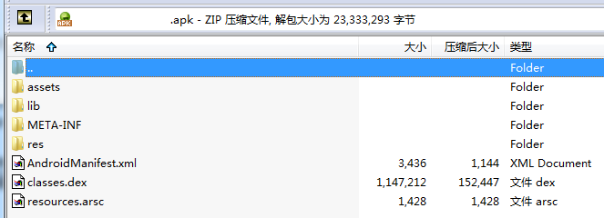

# 	Android Dynamical Loading

## 动态加载 系列文章 目录

00-Android动态加载技术 简单易懂的介绍方式
>  
https://segmentfault.com/a/1190000004062866

01-Android动态加载补充 加载SD卡中的SO库
>  
https://segmentfault.com/a/1190000004062899

## 《00-Android动态加载技术 简单易懂的介绍方式》学习笔记

传统PC软件中的动态加载技术：   
许多的PC软件的安装目录里面都有大量的DLL文件（Dynamic Link Library）,PC软件则是通过调用这些DLL里面的代码执行特定的功能的，这就是一种动态加载技术。

Java中的动态加载技术：   
熟悉Java的同学应该比较清楚，Java的可执行文件是Jar，运行在虚拟机上JVM上，虚拟机通过ClassLoader加载Jar文件并执行里面的代码。所以Java程序也可以通过动态调用Jar文件达到动态加载的目的。

Android应用类似于Java程序，**虚拟机JVM换成了Dalvik/ART**，而**Jar换成了Dex**。

一个APK一旦构建出来，我们是无法更换里面的Dex文件的，但是我们可以通过加载外部的Dex文件来实现动态加载，这个外部文件可以放在外部存储，或者从网络下载。

普通的APK 一般我们是可以通过 解压工具打开的，但是加了密的就不行了，会看到 什么 压缩格式损坏。

**动态加载的定义**

Android项目中，动态加载技术按照加载的可执行文件的不同大致可以分为两种：

	动态加载so库；
	动态加载dex/jar/apk文件（现在动态加载普遍说的是这种）；

**Android动态加载的大致过程**

出于安全问题，Android并不允许直接加载手机外部存储这类noexec（不可执行）存储路径上的可执行文件。

对于这些外部的可执行文件，在Android应用中调用它们前，都要先把他们拷贝到data/packagename/内部储存文件路径，确保库不会被第三方应用恶意修改或拦截，然后再将他们加载到当前的运行环境并调用需要的方法执行相应的逻辑，从而实现动态调用。

动态加载的大致过程就是：

	把可执行文件（.so/dex/jar/apk）拷贝到应用APP内部存储；
	加载可执行文件；
	调用具体的方法执行业务逻辑；

两种动态加载的实现方式

01 **动态加载so库**

02 **动态加载 dex/jar/apk文件**

	网上有多种基于ClassLoader的Android动态加载的开源项目，大部分核心思想都殊途同归，按照复杂程度以及具体实现的框架，大致可以分为以下三种形式，或者说模式.

	01.简单的动态加载模式

	理解ClassLoader的工作机制后，我们知道了Android应用在运行时使用ClassLoader动态加载外部的dex文件非常简单，不用覆盖安装新的APK，就可以更改APP的代码逻辑。

	限制：但是Android却很难使用插件APK里的res资源，这意味着无法使用新的XML布局等资源，同时由于无法更改本地的Manifest清单文件，所以无法启动新的Activity等组件。

	解决办法：不过可以先把要用到的全部res资源都放到主APK里面，同时把所有需要的Activity先全部写进Manifest里，只通过动态加载更新代码，不更新res资源，如果需要改动UI界面，可以通过使用纯Java代码创建布局的方式绕开XML布局。同时也可以使用Fragment代替Activity，这样可以最大限度得避开“无法注册新组件的限制”。
	
	02.代理Activity模式

	主要有以下特点：

	宿主APK可以启动未安装的插件APK；
	插件APK也可以作为一个普通APK安装并且启动；
	插件APK可以调用宿主APK里的一些功能；
	宿主APK和插件APK都要接入一套指定的接口框架才能实现以上功能；

	同时也主要有一下几点限制：

	需要在Manifest注册的功能都无法在插件实现，比如应用权限、LaunchMode、静态广播等；
	宿主一个代理用的Activity难以满足插件一些特殊的Activity的需求，插件Activity的开发受限于代理Activity；
	宿主项目和插件项目的开发都要接入共同的框架，大多时候，插件需要依附宿主才能运行，无法独立运行；

	03.动态创建Activity模式
	
	动态创建Activity模式的核心是“运行时字节码操作”，现在宿主注册一个不存在的Activity，启动插件的某个Activity时都把想要启动的Activity替换成前面注册的Activity，从而是后者能正常启动。

	这个模式有以下特点：
	
	主APK可以启动一个未安装的插件APK；
	插件APK可以是任意第三方APK，无需接入指定的接口，理所当然也可以独立运行；

## 《01Android动态加载补充 加载SD卡中的SO库》学习笔记

System.loadLibrary() 运行的流程

	System.loadLibrary() --> Runtime.loadLibrary() 

	// 先用 findLibrary 获取 完整路径
	loader.findLibrary(libraryName) --> pathList.findLibrary(name)
	再用 doLoad()

	//到这里已经明朗了，根据传进来的libName，扫描APK内部的nativeLibrary目录，获取并返回内部SO库文件的完整路径filename。再回到Runtime类，获取filename后调用了“doLoad”方法

System.load()  运行的流程

	load() --> doLoad()

	最终效果可以做到：  
	先把SO放在Asset里，或者SD卡里，然后再复制到内部存储，再使用load方法把其加载进来。

有2个demo,
一个从 libs 读取 so库 
一个从assert 拷贝so库到 拷贝到data/packagename/内部储存文件路径，再去读取SO库。

## 《02Android动态加载基础 ClassLoader工作机制》学习笔记

**一个运行的Android应用至少有2个ClassLoader。**

	一个是BootClassLoader（系统启动的时候创建的），
	另一个是PathClassLoader（应用启动时创建的，用于加载“/data/app/me.kaede.anroidclassloadersample-1/base.apk”里面的类）

**ClassLoader 双亲代理模型**

	创建一个ClassLoader实例的时候，需要使用一个现有的ClassLoader实例作为新创建的实例的Parent。这样一来，一个Android应用，甚至整个Android系统里所有的ClassLoader实例都会被一棵树关联起来，这也是ClassLoader的 双亲代理模型（Parent-Delegation Model）的特点。

JVM中ClassLoader通过defineClass方法加载jar里面的Class，而Android中这个方法被弃用了。

取而代之的是loadClass方法

从源码中我们也可以看出，loadClass方法在加载一个类的实例的时候，

		1.会先查询当前ClassLoader实例是否加载过此类，有就返回；  
		2.如果没有。查询Parent是否已经加载过此类，如果已经加载过，就直接返回Parent加载的类；  
		3.如果继承路线上的ClassLoader都没有加载，才由Child执行类的加载工作；  

这样做有个明显的特点，如果一个类被位于树根的ClassLoader加载过，那么在以后整个系统的生命周期内，这个类永远不会被重新加载。

**使用ClassLoader一些需要注意的问题**

如果你希望通过动态加载的方式，加载一个新版本的dex文件，使用里面的新类替换原有的旧类，从而修复原有类的BUG，那么你必须保证在加载新类的时候，旧类还没有被加载，因为如果已经加载过旧类，那么ClassLoader会一直优先使用旧类。

如果旧类总是优先于新类被加载，我们也可以使用一个与加载旧类的ClassLoader没有树的继承关系的另一个ClassLoader来加载新类，因为ClassLoader只会检查其Parent有没有加载过当前要加载的类，如果两个ClassLoader没有继承关系，那么旧类和新类都能被加载。

在Java中，只有当两个实例的类名、包名以及加载其的ClassLoader都相同，才会被认为是同一种类型。上面分别加载的新类和旧类，虽然包名和类名都完全一样，但是由于加载的ClassLoader不同，所以并不是同一种类型，在实际使用中可能会出现类型不符异常。

	同一个Class = 相同的 ClassName + PackageName + ClassLoader

**DexClassLoader 和 PathClassLoader**

在Android中，ClassLoader是一个抽象类，实际开发过程中，我们一般是使用其具体的子类DexClassLoader、PathClassLoader这些类加载器来加载类的，它们的不同之处是：

- DexClassLoader可以加载jar/apk/dex，可以从SD卡中加载未安装的apk；
- PathClassLoader只能加载系统中已经安装过的apk；

**Android程序比起一般Java程序在使用动态加载时麻烦在哪里**

说到底，抛开虚拟机的差别不说，一个Android程序和标准的Java程序最大的区别就在于他们的上下文环境（Context）不同。Android中，这个环境可以给程序提供组件需要用到的功能，也可以提供一些主题、Res等资源，其实上面说到的两个问题都可以统一说是这个环境的问题，而现在的各种Android动态加载框架中，核心要解决的东西也正是“如何给外部的新类提供上下文环境”的问题。

	补充 有哪些上下文环境
	01 Android中许多组件类（如Activity、Service等）是需要在Manifest文件里面注册后才能工作的
	02 Res资源是Android开发中经常用到的，而Android是把这些资源用对应的R.id注册好，运行时通过这些ID从Resource实例中获取对应的资源。【图标就是放在Res资源里面的】
	03 Assets资源【这个好像不属于 上下文环境】

## 

## 

01 从头开始学习。

Android动态加载补充 加载SD卡中的SO库
https://segmentfault.com/a/1190000004062899

个人博客
https://segmentfault.com/blog/kaede

Android动态加载技术 系列索引
https://segmentfault.com/a/1190000004086213

Android动态加载黑科技 动态创建Activity模式
https://segmentfault.com/a/1190000004077469

02 换条路，看有没有 其他 cocos开发者 做过 游戏调用游戏。 